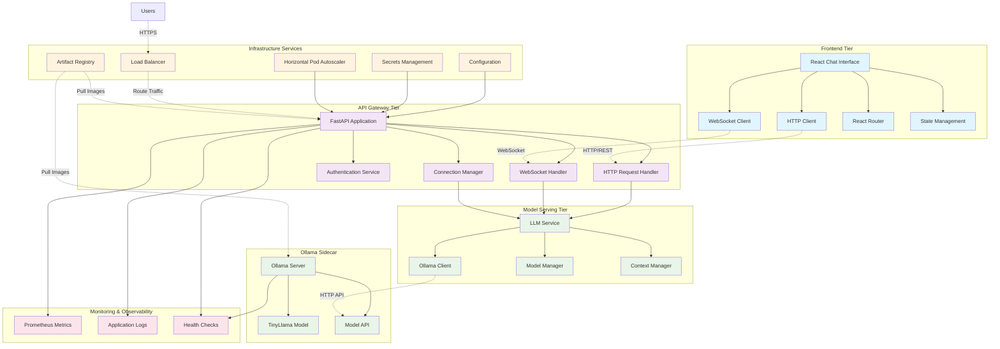
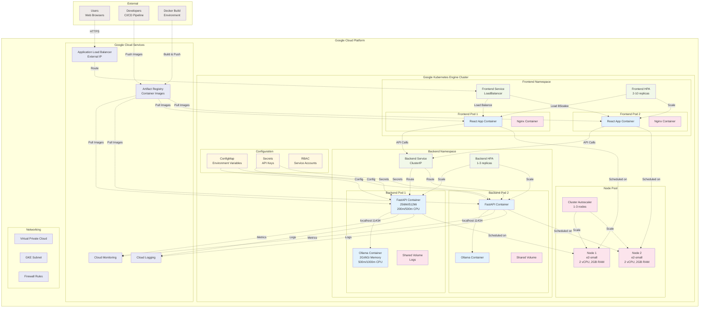
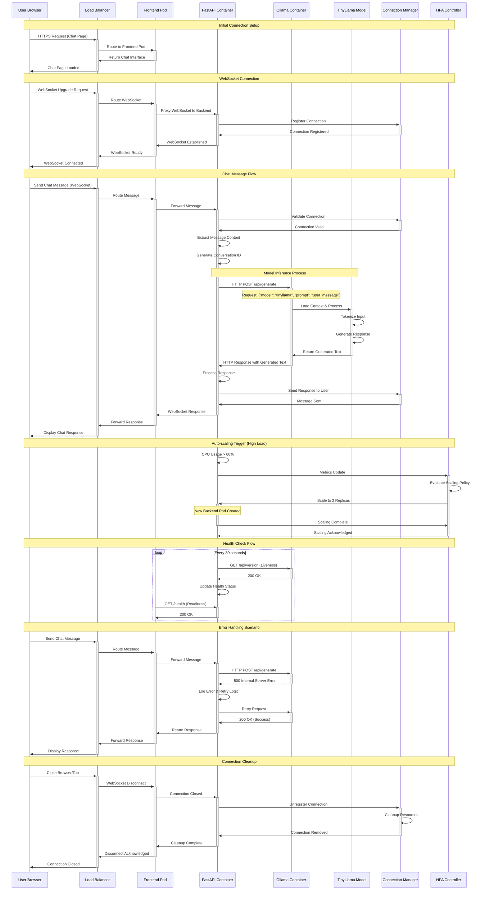
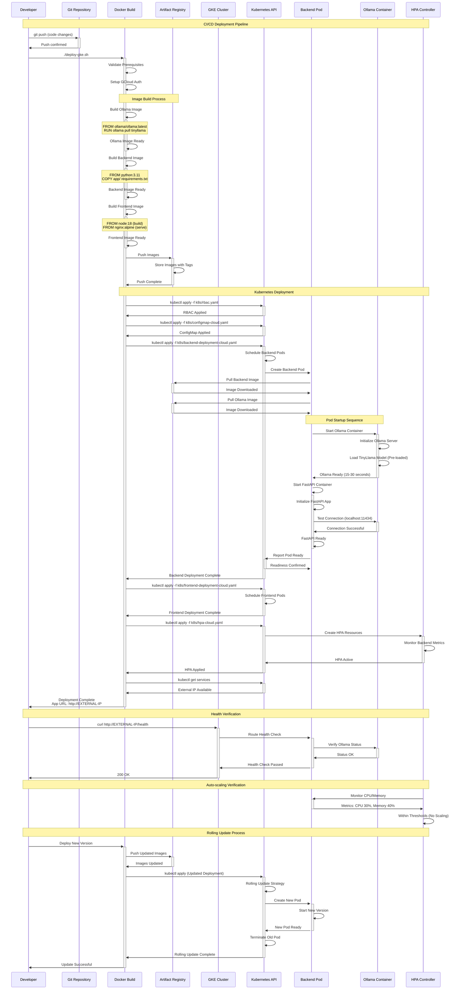

# UML Diagrams for Scalable LLM Chatbot Infrastructure

## 1. Component Diagram

## 2. Deployment Diagram

## 3. Sequence Diagram - User Chat Interaction

## 4. Sequence Diagram - Deployment Process

These UML diagrams provide comprehensive visualization of:

1. **Component Diagram**: Shows the internal structure and relationships between all system components
2. **Deployment Diagram**: Illustrates the physical deployment architecture on Google Cloud Platform
3. **Sequence Diagrams**: Detail the runtime behavior for both user interactions and deployment processes

The diagrams capture the key architectural decisions including the sidecar pattern, pre-loaded models, auto-scaling mechanisms, and cloud-native deployment strategies. 